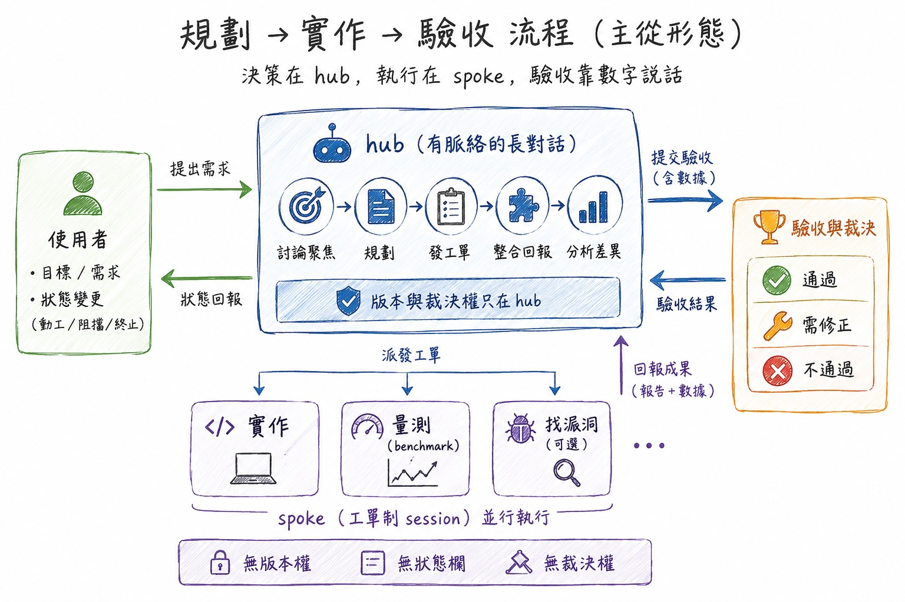

# ai-workflow-hub-spoke

[English](en/README.md)

一套給 Claude Code 使用的 **AI 協作流程規範**，以「主從形態（hub-spoke）」組織「規劃 → 實作 → 驗收」的完整開發流程。本專案不含應用程式碼，內容是可複用的流程文件與 Claude Code skills，可作為其他專案導入此工作模式的範本。



## 核心理念

> 規劃書是決策過程的有損投影；誰持有活脈絡，誰做那件事就便宜。

因此流程設計為：**規劃與裁決留在有脈絡的 hub（長對話），執行下放到工單制的 spoke（獨立 session），品質裁決交給數字（benchmark）**。

## 角色分工

| 角色 | 職責 | 權限 |
| --- | --- | --- |
| **使用者** | 做不做、目標、狀態變更（動工／阻擋／終止） | 裁量權無需舉證，一句話生效 |
| **hub**（有脈絡的長對話） | 討論聚焦、寫規劃、發工單、融合 spoke 回報 | 版本只從 hub 出 |
| **spoke**（工單制 session） | 實作、量測（benchmark）、找漏洞（可選） | 無版本權、無狀態欄、無裁決權 |

## 流程總覽

```
0. 決策討論（hub＋使用者）→ decision 文件
1. 規劃（hub，依必答檢查）→ plan 文件 → 使用者審定
   （可選：/find-holes 派「找漏洞 spoke」）
2. 實作（spoke）→ test/lint/tsc/build 全綠 → report＋runbook（收尾用 /wrap）
3. 熱修補（同 session 續命）→ 每修一筆 append issue_log
4. 驗收（使用者）：照 runbook 手測＋diff 過目 → commit/PR
```

## 專案內容

### [AGENTS.md](AGENTS.md) — 流程規範本體

定義整套工作規則，重點包括：

- **文件紀律**：六種文件各司其職——`decision` 記 why、`plan` 記 how、`facts` 記已驗事實（append-only）、`report` 記交付狀態（產出後不回改）、`runbook` 記手測步驟、`issue_log` 記修補帳（append-only）。
- **出處三規則（防走私）**：「依使用者裁示」必附出處；驗收門檻必附推導；先例引用「給尺不給屍」。
- **品質賭注條款**：模型／prompt／呼叫機制的選擇一律由 benchmark 裁決，事前訂死門檻、不事後翻案。
- **實作 session 紀律**：開場列 todo、不用 compact（context 吃緊改走收尾或交接）、偏離規劃記入 report。
- **規劃書必答檢查**：引用即驗證、失敗態與時間窗、計費呼叫的閘門順序、新端點防護、可實作性驗證、雙向生命週期——六條缺一不可，不得留白。

### `.claude/skills/` — Claude Code skills

| Skill | 用途 |
| --- | --- |
| [/find-holes](.claude/skills/find-holes/SKILL.md) | 對規劃書派「找漏洞 spoke」：hub 裁剪 need-to-know 工單，派 1–3 個不同視角（可行性／失敗態與併發／成本閘門與安全）的唯讀 sub-agent 找漏洞，回收意見清單交使用者裁決。spoke 只產意見、不產裁決。 |
| [/wrap](.claude/skills/wrap/SKILL.md) | 實作收尾：自檢 test/lint/tsc/build 四綠、確認 report/runbook/issue_log 齊備、產出使用者手測清單與 diff 對照摘要。context 吃緊未完工時走「中途交接」模式，寫 handoff 文件後關 session、新 session 冷啟動。 |

## 使用方式

1. 將 `AGENTS.md` 與 `.claude/skills/` 複製（或引用）到目標專案。
2. 在 hub session 與使用者討論並產出 decision／plan 文件。
3. 規劃審定後，開實作 spoke session 以「依 X 文件實作」開場。
4. 實作完成用 `/wrap` 收尾，使用者依 runbook 手測驗收後才 commit/PR。

## 設計要點

- **版本只從 hub 出**：spoke 的產出永遠不直接成為文件版本，一律經 hub 融合。
- **不用 compact**：context 壓縮有損，吃緊時改在自然斷點收尾或寫交接文冷啟動。
- **裁決權在使用者**：文件不得自訂翻案條件，狀態欄變更權專屬使用者。
