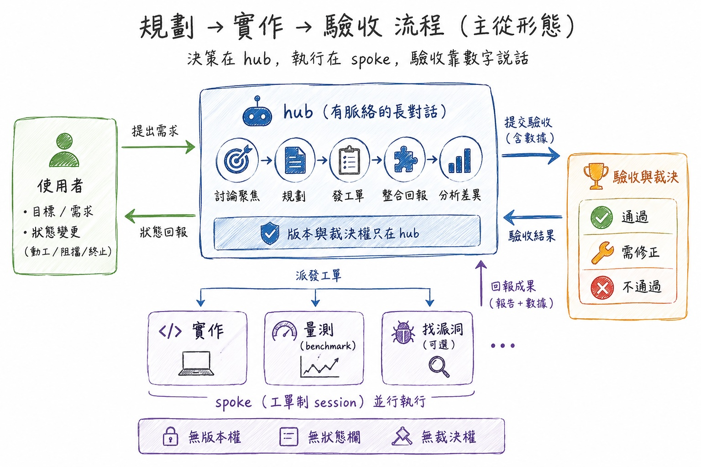

# ai-workflow-hub-spoke

[English](en/README.md) ｜ **繁體中文**

> ## 這個專案已退場，方法論留在這裡，工具請用 [`dowafu`](https://github.com/eyesofkids/dowafu)
>
> 本 repo 原本同時放「流程方法論」與「Claude Code 的 skill／agent 實作」。
> **實作的部分已經整批被 `dowafu` 取代並刪除**，這裡只留方法論文件與那篇文章的配圖。
>
> ```bash
> npm install -g dowafu
> ```
>
> - 原始碼與說明：<https://github.com/eyesofkids/dowafu>
> - npm：<https://www.npmjs.com/package/dowafu>
> - **現行的 skill 與 lens 定義以 `dowafu` 的 `publish/` 為準**，本 repo 不再維護副本

## 為什麼工具的部分退場

2026-08-08 的實測結論：**方法論是對的，但用 Claude Code 的自訂 sub-agent 去實作它，效果達不到預期。**
派出去的 spoke，工單本身在它 context 裡的佔比可能不到 3%——專案愈大愈不理想，而且各種情況難以量測。
這有可能是自訂 sub-agent 的通病。

**結論不是「這條路走不通」，是「執行者不該由 host 的 sub-agent 擔任」。**
`dowafu` 走的是另一條：spoke 是**外部模型的 API 呼叫**，工單、可讀檔案白名單、費用閘門、
產出稽核全部由 CLI 控制，不受 host 的 context 機制影響。同一套 hub-spoke 方法論，換了執行層。

（VS Code Copilot 版本也一併移除。它的問題同源且更嚴重：spoke 的 context 有九成以上塞的是與工作
無關的內容，還會繼承整個專案的 `AGENTS.md`。）

## 方法論本體

**規範全文已隨工具移到 `dowafu`**，兩種語言各一份，複製到自己專案就能用：

| 文件 | 語言 |
| --- | --- |
| [`publish/zh-tw/workflow_spec.md`](https://github.com/eyesofkids/dowafu/blob/main/publish/zh-tw/workflow_spec.md) | 繁體中文 |
| [`publish/en/workflow_spec.md`](https://github.com/eyesofkids/dowafu/blob/main/publish/en/workflow_spec.md) | English |

以下是它的摘要。

> 規劃書是決策過程的有損投影；誰持有活脈絡，誰做那件事就便宜。

因此流程設計為：**規劃與裁決留在有脈絡的 hub（長對話），執行下放到工單制的 spoke，
品質裁決交給數字（benchmark）。**



### 角色分工

| 角色 | 職責 | 權限 |
| --- | --- | --- |
| **使用者** | 做不做、目標、狀態變更（動工／阻擋／終止） | 裁量權無需舉證，一句話生效 |
| **hub**（有脈絡的長對話） | 討論聚焦、寫規劃、發工單、融合 spoke 回報 | 版本只從 hub 出 |
| **spoke**（工單制） | 實作、量測、找漏洞 | 無版本權、無狀態欄、無裁決權 |

### 流程總覽

```
0. 決策討論（hub＋使用者）→ decision 文件
1. 規劃（hub，依必答檢查）→ plan 文件 → 使用者審定
   （可選：派「找漏洞 spoke」——產出觀察、不產裁決）
2. 實作（spoke）→ test/lint/typecheck/build 全綠 → report＋runbook
3. 熱修補（同 session 續命）→ 每修一筆 append issue_log
4. 驗收（使用者）：照 runbook 手測＋diff 過目 → commit/PR
```

其餘規則——文件紀律（decision／plan／facts／report／runbook／issue_log 各司其職）、
出處三規則、品質賭注條款、規劃書的六條必答檢查——都在上表那兩份 `workflow_spec.md` 裡。

## 延伸閱讀

[Medium：其實我不懂 AI 獨立審查——規劃實作流程主從形態 hub-spoke 是什麼](https://medium.com/@eddychang_86557/%E5%85%B6%E5%AF%A6%E6%88%91%E4%B8%8D%E6%87%82ai-%E7%8D%A8%E7%AB%8B%E5%AF%A9%E6%9F%A5-%E8%A6%8F%E5%8A%83%E5%AF%A6%E4%BD%9C%E6%B5%81%E7%A8%8B%E4%B8%BB%E5%BE%9E%E5%BD%A2%E6%85%8B-hub-spoke-%E6%98%AF%E4%BB%80%E9%BA%BC-ffa892495196)

> 文章寫作當時，本 repo 還帶著 skill 與 agent 的實作；那些檔案現在要去 `dowafu` 找。
