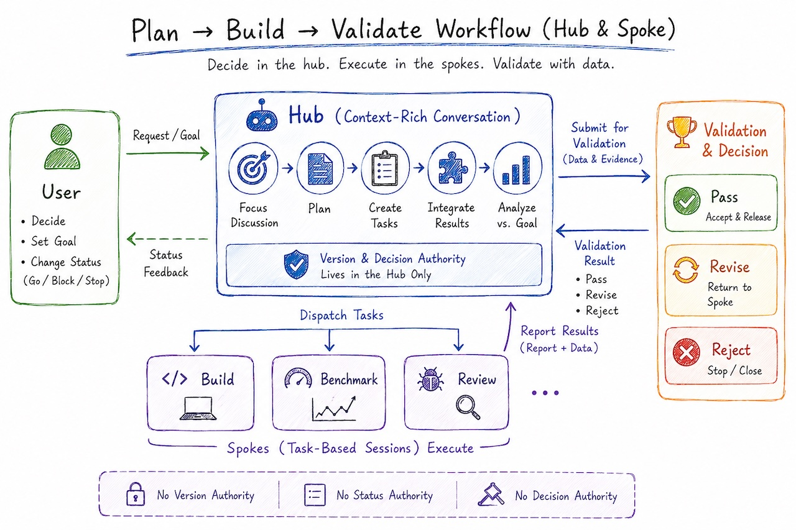

# ai-workflow-hub-spoke

[中文版](../README.md)

A set of **AI collaboration workflow conventions** for Claude Code, organizing the full "plan → implement → accept" development cycle in a **hub-spoke** structure. This project contains no application code — it consists of reusable process documents and Claude Code skills, and serves as a template for adopting this working model in other projects.



## Core Idea

> A plan document is a lossy projection of the decision-making process; whoever holds the live context can do that work most cheaply.

The workflow is therefore organized as: **planning and adjudication stay in the hub (a long-lived conversation with full context), execution is delegated to ticket-driven spokes (independent sessions), and quality judgments are settled by numbers (benchmarks)**.

## Roles

| Role | Responsibilities | Authority |
| --- | --- | --- |
| **User** | Go/no-go, goals, status changes (start / block / terminate) | Discretion requires **no justification** — one sentence takes effect |
| **Hub** (long-lived session with context) | Focus discussions, write plans, issue work tickets, merge spoke reports | **Versions are only produced by the hub** |
| **Spoke** (ticket-driven session) | Implementation, measurement (benchmarks), hole-finding (optional) | No versioning rights, no status fields, no adjudication rights |

## Workflow Overview

```
0. Decision discussion (hub + user) → decision document
1. Planning (hub, per mandatory checklist) → plan document → user approves directly
   (Optional: /find-holes dispatches "hole-finder spokes")
2. Implementation (spoke) → test/lint/tsc/build all green → report + runbook (wrap up with /wrap)
3. Hotfixes (same session kept alive) → append issue_log per fix
4. Acceptance (user): manual testing per runbook + diff review → commit/PR
```

## Contents

### [AGENTS.md](AGENTS.md) — The workflow conventions

Defines the full set of working rules, highlights include:

- **Document discipline**: six document types, each with a single responsibility — `decision` records the why, `plan` records the how, `facts` records verified facts (append-only), `report` records delivery status (never revised after creation), `runbook` records manual test steps, `issue_log` records the fix ledger (append-only).
- **Three provenance rules (anti-smuggling)**: "per user's ruling" must cite its source; acceptance thresholds must show their derivation; precedents are cited as "the yardstick, not the corpse."
- **Quality wager clause**: choices of model / prompt / invocation mechanism are settled exclusively by benchmarks — thresholds fixed up front, no retroactive appeals.
- **Implementation session discipline**: start by listing todos, never use compact (when context runs low, wrap up or hand off instead), deviations from the plan go into the report.
- **Mandatory plan checklist**: verify-on-cite, failure modes and time windows, gate ordering for billable calls, protection for new endpoints, implementability verification, bidirectional lifecycles — all six required, no blanks allowed.

### `.claude/skills/` — Claude Code skills

| Skill | Purpose |
| --- | --- |
| [/find-holes](.claude/skills/find-holes/SKILL.md) | Dispatches "hole-finder spokes" against a plan document: the hub trims a need-to-know work ticket, dispatches 1–3 read-only sub-agents with distinct lenses (feasibility / failure modes & concurrency / cost gates & security) to find holes, then collects their observations for the user to adjudicate. Spokes produce opinions only, never verdicts. |
| [/wrap](.claude/skills/wrap/SKILL.md) | Implementation wrap-up: self-check that test/lint/tsc/build are all green, confirm report/runbook/issue_log are complete, produce a manual-test checklist and a diff-versus-plan summary for the user. When context runs low before the work is done, switch to "mid-work handoff" mode — write a handoff document, close the session, and cold-start a new one. |

## How to Use

1. Copy (or reference) `AGENTS.md` and `.claude/skills/` into the target project.
2. Discuss with the user in a hub session and produce decision / plan documents.
3. Once the plan is approved, open an implementation spoke session starting with "implement per document X."
4. Wrap up with `/wrap`; the user manually tests per the runbook before any commit/PR.

## Design Principles

- **Versions are only produced by the hub**: spoke output never becomes a document version directly — it is always merged through the hub.
- **Never use compact**: context compaction is lossy; when context runs low, wrap up at a natural break point or write a handoff document and cold-start.
- **Adjudication belongs to the user**: documents may not define their own overturn conditions; status-field changes are exclusively the user's.
