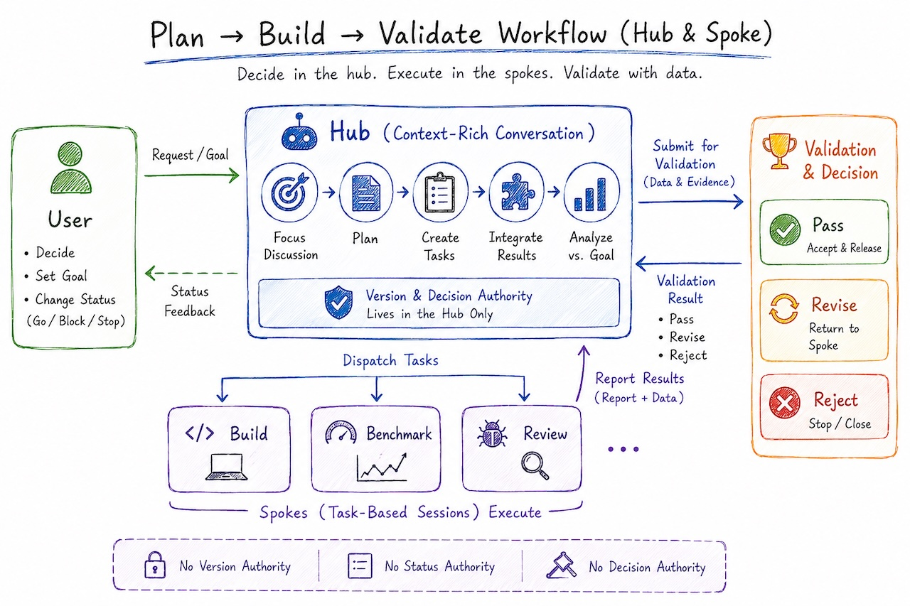

# ai-workflow-hub-spoke

**English** ｜ [繁體中文](../README.md)

> ## This project is retired. The methodology stays here; for the tooling, use [`dowafu`](https://github.com/eyesofkids/dowafu)
>
> This repository used to hold both a workflow methodology and a Claude Code implementation of
> it (skills and sub-agents). **The implementation has been superseded by `dowafu` and deleted
> from here.** What remains is the methodology document and the diagram from the article.
>
> ```bash
> npm install -g dowafu
> ```
>
> - Source and documentation: <https://github.com/eyesofkids/dowafu>
> - npm: <https://www.npmjs.com/package/dowafu>
> - **The current skills and lens definitions live in `dowafu`'s `publish/`.** No copy is
>   maintained here any more.

## Why the tooling was retired

What the 2026-08-08 testing showed: **the methodology holds, but implementing it with Claude
Code's custom sub-agents does not deliver.** In a dispatched spoke, the ticket itself may
account for under 3% of the context it works from — worse the larger the project gets, and
hard to measure in any given case. This may be a general problem with custom sub-agents.

**The conclusion was not "this approach fails", it was "the executor should not be one of the
host's own sub-agents".** `dowafu` takes the other route: a spoke is an API call to an external
model, and the ticket, the read allowlist, the spend gate, and the audit of what came back are
all controlled by the CLI rather than by the host's context machinery. Same hub-and-spoke
methodology, different execution layer.

(The VS Code Copilot variant is gone as well. Its problem was the same one, worse: over 90% of
a spoke's context was material unrelated to the task, and it inherited the project's entire
`AGENTS.md` on top of that.)

## The methodology itself

**The full specification moved to `dowafu` along with the tooling**, one file per language,
ready to copy into a project of your own:

| Document | Language |
| --- | --- |
| [`publish/en/workflow_spec.md`](https://github.com/eyesofkids/dowafu/blob/main/publish/en/workflow_spec.md) | English |
| [`publish/zh-tw/workflow_spec.md`](https://github.com/eyesofkids/dowafu/blob/main/publish/zh-tw/workflow_spec.md) | 繁體中文 |

What follows is a summary of it.

> A design document is a lossy projection of the decision process; whoever holds the live
> context does that piece of work most cheaply.

Hence the shape: **planning and adjudication stay with the hub (the long conversation),
execution is delegated to ticket-scoped spokes, and quality questions are settled by numbers.**



### Roles

| Role | Responsibility | Authority |
| --- | --- | --- |
| **User** | Whether to do it, the goal, state changes (start / block / stop) | Discretion needs no justification; one sentence takes effect |
| **hub** (the long conversation) | Focus the discussion, write the plan, issue tickets, merge what spokes report | Versions come only from the hub |
| **spoke** (ticket-scoped) | Implement, measure, find holes | No version authority, no status field, no adjudication |

### The flow

```
0. Decision discussion (hub + user)      → decision document
1. Planning (hub, against the mandatory checks) → plan document → the user approves it
   (optional: dispatch hole-finding spokes — they produce observations, not verdicts)
2. Implementation (spoke) → test/lint/typecheck/build all green → report + runbook
3. Hot patching (same session) → append one entry per fix to issue_log
4. Acceptance (user): manual test per the runbook + read the diff → commit/PR
```

Everything else — the document discipline (decision / plan / facts / report / runbook /
issue_log, each with one job), the three sourcing rules, the quality-wager clause, and the six
mandatory checks for a plan — is in the `workflow_spec.md` files above.

## Further reading

[Medium (Chinese): what the hub-and-spoke form of planning, implementation, and acceptance actually is](https://medium.com/@eddychang_86557/%E5%85%B6%E5%AF%A6%E6%88%91%E4%B8%8D%E6%87%82ai-%E7%8D%A8%E7%AB%8B%E5%AF%A9%E6%9F%A5-%E8%A6%8F%E5%8A%83%E5%AF%A6%E4%BD%9C%E6%B5%81%E7%A8%8B%E4%B8%BB%E5%BE%9E%E5%BD%A2%E6%85%8B-hub-spoke-%E6%98%AF%E4%BB%80%E9%BA%BC-ffa892495196)

> When that article was written, this repository still shipped the skills and agents. Those
> files now live in `dowafu`.
